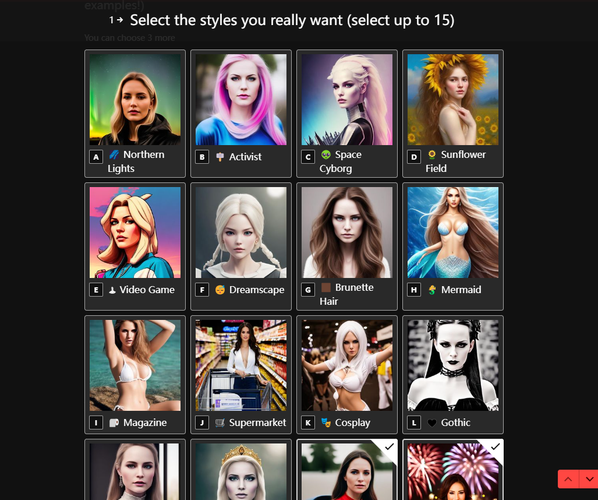
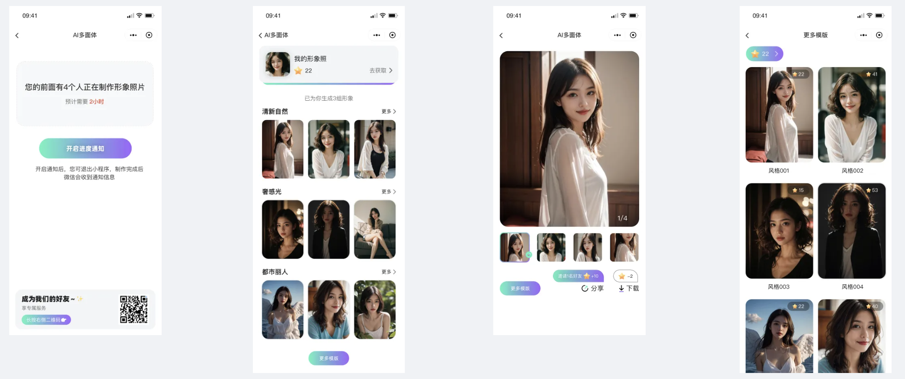

简单叙述下项目的发展由来，叙述方式较为啰嗦，望各位海涵。

## 项目背景/研发初衷

在三、四月份Midjourney在国内热度猛飚时，沉迷做盲盒头像无法自拔；但苦于人像相似度把控问题，调出一张满意的头像需要耗费大半天时间；甚至有的花费了1天多都无法生成满意的图片…… 
  
当时断断续续做了一周时间，帮10个朋友制作了迪士尼风格的卡通头像，其中有5个以上都拿去做微信头像，另外还有朋友开心地po朋友圈；同时了解到市面上有许多小姑娘付费让人用mj基于自己的照片，生成不同风格的美照，制作出卡片等…… 结各方需求情况与成本估算，诞生了开发AI形象应用的想法：
  
**用户只需上传一张照片样本，即可自动生成与本人【极高相似度】的各类风格头像。**
  
毕竟开发干了那么多年、快30岁的人了，总得~~发掘睡后收入~~拥有亲手建立的心血，开发只属于自己的、有正经运营的项目；也算给自己的一个交代吧。
  
  
### 基于Midjourney的研发方案
  
最早的思考是基于Midjourney进行研发，成本是一个月几百元的会员费，还是很有信心能回本的；主要问题在于以下痛点：  
1、脱离人工介入mj，由程序自动上传样本并生成效果图  
2、脱离人工解决相似度问题，寻找能与样本高度匹配出图的技术方案  
  
脱离人工进行图片上传、结合prompt出图的全流程，通过脚本编写是可以解决的；但相似度的问题，始终无法脱离人类反馈，必须得人工识别更符合的照片，并进行迭代绘画，才能获得想要的图。因为相似度问题始终没想通方案，被卡了一段时间，加上一直忙工作，没时间调研其他方案，搁置了一段时间；直到遇到avatarai……
  
  
### Avatarai —— Stable diffsion + Dreambooth + Fine tuning
  
[avatarai](https://avatarai.ai/)最初是做AI头像/写真，目前经过多轮迭代已经大变样；早期的商业方案是一次性消费80~200+（各地区价格不一样），获得110+张头像/写真图，非常简单粗暴。该项目在2022年底发布，没几个月即获利上百万。
  
实现原理是利用用户提供的20张照片样本，利用Dreambooth算法结合sd底模，去进行模型微调Fine tuning，生成出包含用户面容数据的模型文件（可以理解为把用户照片喂给了模型）；同时结合各类prompt即可推理出不同风格、与用户高度相似的的AI效果图。[参考教程在这](https://www.youtube.com/watch?v=Bdl-jWR3Ukc)，自备梯子。
  
这就是我想要的技术方案与商业模式！马上开干！！
  
Avatarai部分截图

  
  
### 学习AIGC
  
作为一个AIGC小白，初期接触这类知识无疑是需要时间的，这期间最难的不是prompt编写，不是模型微调，而是GPU…… T T  开发网站、小程序、服务端和各类运维部署都不是难事，但被GPU卡脖子就非常难受了……为此耽误不少时间，好在后面利用Google Colab实现了流程跑通，证明了技术方案是可行的。但昂贵的GPU成本不由得让人开始怀疑，这条路子是否可行，能否赚钱。不管如何，做这项目的主要目的是作为AI领域的入门门槛，无论如何我都得干出来！
  
利用工作闲暇时不断反复摸索、学习AIGC相关原理知识；同时不断调整各类prompt进行风格尝试，发现出图效果不稳定；要么不像，要么图崩…… 并且耗时过长，用Tesla T4的显卡进行模型微调，10来张照片需要耗时50分钟左右；推理出4张512x512的图需要至少15分钟，不得不担心产品上线体验的问题。没法，继续死磕吧。
  
  
### Lora模型
Lora是从C站与B站上了解到的，只需任务几张图即可制作专属的Lora模型，而且效果不错；但是同样吃配置，因硬件不给力所以未进行尝试，但这方案是可行的。
  
### 现在的方案
  
面对一直卡脖子的局面，不知为何心理不慌，始终觉得下半年开始才会好起来…… 这不，7月份一到，新技术方案来了，是目前最满意最可行的技术方案。
  
- 只需一张照片，规避了多样本的用户隐私问题；
- 无需走模型微调，降低了硬件要求；
- 使用M1无额外独显的iMac，出图4张仅需13分钟左右，耗时降低非常多。
  
暂时不公布是啥方案了，等后面再具体聊~
  
目前已经基本完成了小程序的开发，在内部测试中；晚点走周围朋友进行灰度测试，通过后即可正式发布上线，敬请期待。
  

  
  
## 产品方向思考路径
在研发项目的路上一直在思考，AIGC如此火热，始终只有少数人才能体会到它的厉害之处；对绝大多数人民群众而言，观念依旧停留在那个“人工智障“、“AI远远无法代替人类“阶段；市场上缺少了一个可以给平民大众无门槛使用，获巨大利益并且能颠覆他们以往观念的产品。AI头像/写真非常适合做这个产品。
  
这不，妙鸭出了之后，和羊了又羊同样爆火，甚至有新闻联播替他们“宣传“。
  
**这类产品，在未来会越来越多。想避免走35岁“断头路“的各位，可以好好研究下。**
  
【产品路径】
 - 最初规划是做AI头像， 制作与用户高度相似的各类图，模式参照Avatarai；类似现在美颜相的AI头像，但效果会比他的好非常多；
 - 二阶段规划同妙鸭基本一致，做各类风格的人像写真、证件照；替代影楼、天真蓝等摄影机构；
 - 提供Open API服务，进一步降低大家的门槛，同时也丰富商业模式；
 - 其他还有零碎的想法，诸如更换发型、盲盒、小朋友的成人形象、web3赛博朋克NFT头像……等等，有很多产品模式与商业方案，就不展开了；（有金主爸爸需要的欢迎联系我~）
  
## 反思
一路过来也算挺辛苦，毕竟闲暇时间不多，且通勤距离过远，每天2-3点睡是常态，早上7点多起床。加上是非熟悉领域的东西，耗时不言而喻，项目进度一拖再拖…… 但好在，坚持下来了，也学习了非常多的知识；在这广袤无垠的领域里，相信未来会有一番发展。
  
现在的AI相当于早期互联网大蛮荒时代，充斥着许多机会与风险，也是资本目前最热衷的领域；相信只要有付出，必然能获得上班收入更高的回报。
  
有兴趣的小伙伴可以一起结伴同行~ （联系方式在项目介绍中）
  
---
  
如果对你有用，欢迎star、投币支持~
  

  
可否来杯瑞幸支持下？:P